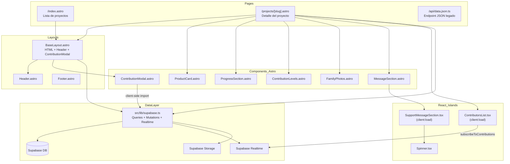
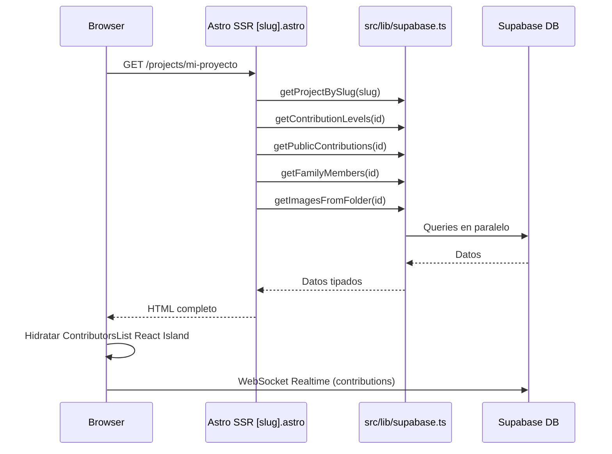
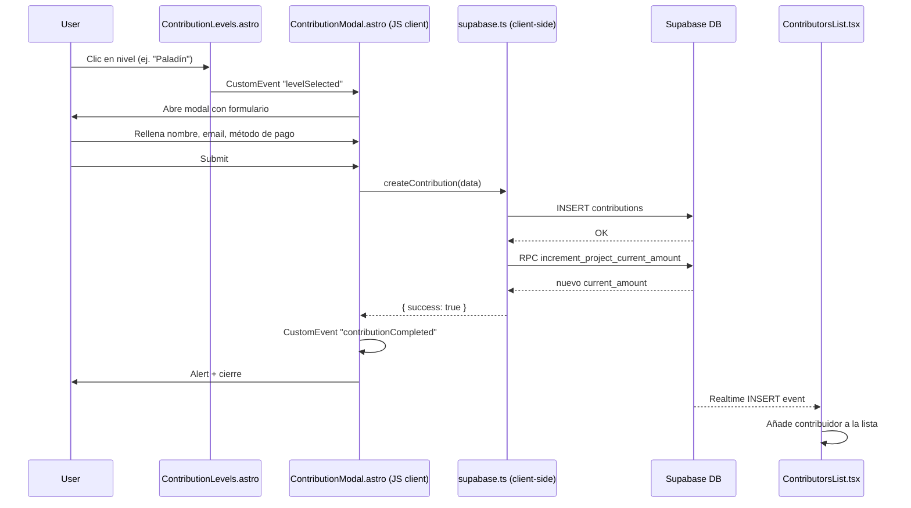
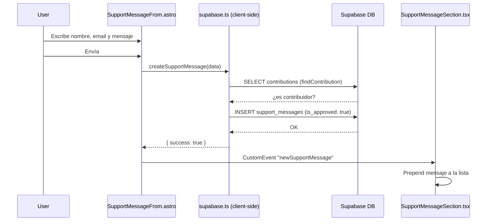

# Arquitectura

## Patrón arquitectónico

**Monolito modular con Islands Architecture** (patrón nativo de Astro).

- El servidor renderiza HTML completo en cada petición (SSR).
- Los componentes interactivos se "hidratan" en el cliente como React Islands (`client:load`).
- No hay separación frontend/backend en repositorios distintos — todo convive en un único proyecto.

## Capas y responsabilidades

| Capa | Directorio | Responsabilidad |
|------|-----------|-----------------|
| **Páginas** | `src/pages/` | Routing, SSR, composición de componentes, fetch de datos inicial |
| **Layouts** | `src/layouts/` | HTML shell, Header, Footer, modal global de contribución |
| **Componentes Astro** | `src/components/` | Secciones de la UI (ProductCard, ProgressSection, etc.) |
| **Islands React** | `src/components/react/` | UI interactiva con estado: lista en tiempo real, mensajes |
| **UI atómicos** | `src/components/UI/` | Componentes reutilizables (Modal, CloseButton, Spinner) |
| **Data layer** | `src/lib/supabase.ts` | Toda la lógica de acceso a datos — queries, inserts, realtime |
| **Helpers** | `src/helpers/` | Utilidades puras (formateo de fechas) |
| **Assets** | `public/` | CSS global, imágenes estáticas |

## Diagrama de componentes

## Flujos principales

### Flujo 1: Cargar una página de proyecto

### Flujo 2: Registrar una contribución

### Flujo 3: Enviar mensaje de apoyo

## Decisiones de diseño

| Decisión | Justificación |
|----------|---------------|
| SSR completo (no static) | Los datos (contribuciones, progreso) cambian frecuentemente; no se puede prebuildear |
| Supabase Realtime en cliente | Actualizaciones instantáneas sin polling; el cliente se subscribe directamente al canal WS |
| `createContribution` con `payment_status: 'completed'` al insertar | El pago es offline (Bizum/efectivo). La contribución se registra como completada por honor |
| RPC atómica + fallback JS | `increment_project_current_amount` usa función PL/pgSQL para atomicidad; si falla, cae en read+update JS |
| `is_approved: true` por defecto en mensajes | Moderación optimista — todos los mensajes se aprueban automáticamente |
| Sin autenticación de usuario | Plataforma familiar de confianza; no se necesita login |
| Stripe instalado pero inactivo | Preparación para pagos futuros con tarjeta |
