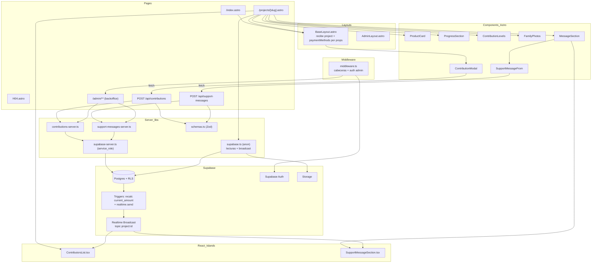
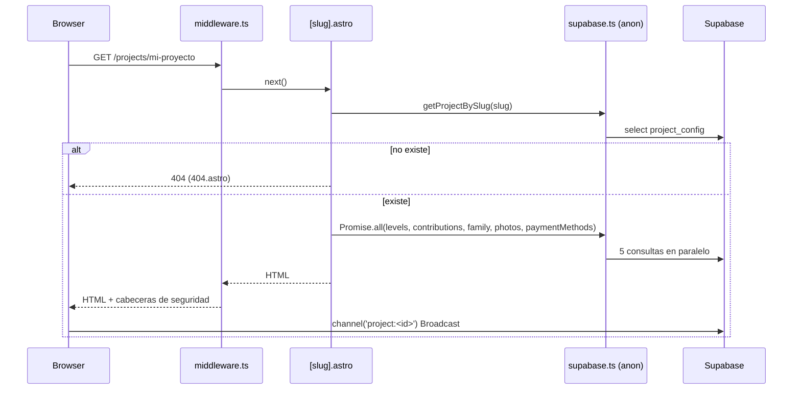
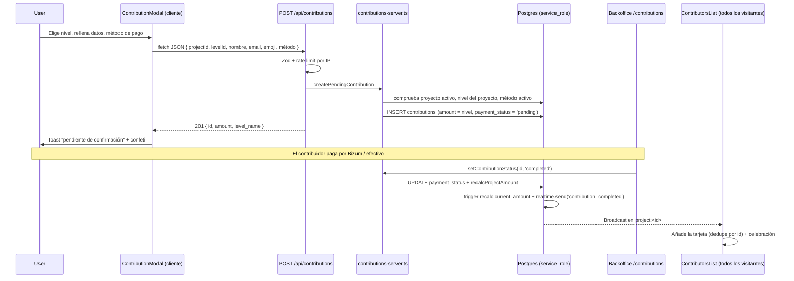
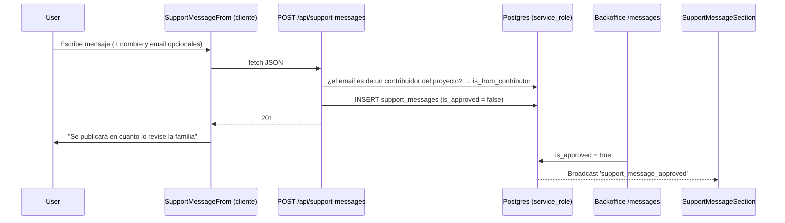
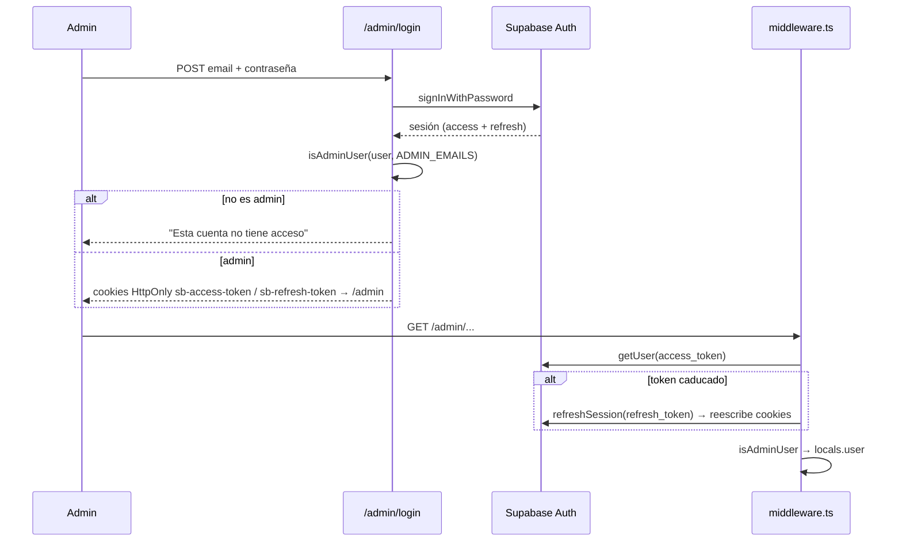

# Arquitectura

## Patrón arquitectónico

**Monolito modular con Islands Architecture** (patrón nativo de Astro), con una regla añadida desde 2026-09:
**el navegador solo lee; toda escritura pasa por el servidor.**

- El servidor renderiza HTML completo en cada petición (SSR, adapter Node standalone).
- Los componentes interactivos se hidratan en el cliente como React Islands (`client:load`).
- El cliente usa la clave `anon` de Supabase únicamente para lecturas y para recibir eventos Realtime.
- Las escrituras (contribuciones, mensajes, backoffice) las hacen endpoints Astro con la clave `service_role`,
  validando la entrada con Zod.
- `current_amount` lo mantiene un trigger de Postgres a partir de las contribuciones confirmadas.

## Capas y responsabilidades

| Capa | Directorio | Responsabilidad |
|------|-----------|-----------------|
| **Middleware** | `src/middleware.ts` | Cabeceras de seguridad en todas las respuestas; auth + rol de administrador y refresco de sesión en `/admin/*` |
| **Páginas públicas** | `src/pages/` | Routing, SSR, composición de componentes, fetch inicial de datos (en paralelo) |
| **Endpoints** | `src/pages/api/` | `POST /api/contributions`, `POST /api/support-messages`: validan con Zod, limitan por IP y escriben con service role |
| **Backoffice** | `src/pages/admin/` | Login, proyectos, niveles, emojis, confirmación de pagos y moderación de mensajes (formularios `POST` clásicos) |
| **Layouts** | `src/layouts/` | HTML shell público (`BaseLayout`) y de administración (`AdminLayout`) |
| **Componentes Astro** | `src/components/` | Secciones de la página de proyecto |
| **Islands React** | `src/components/react/` | Lista de contribuidores y muro de mensajes; se actualizan por Broadcast |
| **UI atómicos** | `src/components/UI/` | Modal, CloseButton, Spinner, badge |
| **Data layer (lectura)** | `src/lib/supabase.ts` | Tipos, consultas públicas y `subscribeToProjectEvents` |
| **Data layer (escritura)** | `src/lib/contributions-server.ts`, `src/lib/support-messages-server.ts`, `src/lib/supabase-server.ts` | Lógica de servidor con service role |
| **Límites** | `src/lib/schemas.ts`, `src/lib/env-schema.ts`, `src/lib/project-form.ts` | Esquemas Zod: cuerpos HTTP, formularios y variables de entorno |
| **Reglas de campaña** | `src/lib/campaign.ts` | Apertura/cierre por `end_date`, días restantes, totales (recaudado + base) |
| **Utilidades** | `src/lib/{authz,session-cookies,api,rate-limit,format,html}.ts`, `src/helpers/` | Autorización, cookies, respuestas JSON, rate limit, moneda, escape HTML, fechas |
| **Base de datos** | `supabase/migrations/` | Triggers, broadcast, defaults, índices y políticas RLS versionadas |

## Diagrama de componentes

```mermaid
graph TD
    subgraph Pages
        Index["/index.astro"]
        Slug["/projects/[slug].astro"]
        NotFound["/404.astro"]
        Admin["/admin/** (backoffice)"]
        ApiC["POST /api/contributions"]
        ApiM["POST /api/support-messages"]
    end

    subgraph Middleware
        MW["middleware.ts<br/>cabeceras + auth admin"]
    end

    subgraph Layouts
        BaseLayout["BaseLayout.astro<br/>recibe project + paymentMethods por props"]
        AdminLayout["AdminLayout.astro"]
    end

    subgraph Components_Astro
        ProductCard
        ProgressSection
        ContributionLevels
        FamilyPhotos
        MessageSection
        ContributionModal
        SupportMessageFrom
    end

    subgraph React_Islands
        ContributorsList["ContributorsList.tsx"]
        SupportMessageSection["SupportMessageSection.tsx"]
    end

    subgraph Server_libs
        SupabaseRead["supabase.ts (anon)<br/>lecturas + broadcast"]
        SupabaseAdmin["supabase-server.ts (service_role)"]
        ContribSrv["contributions-server.ts"]
        MsgSrv["support-messages-server.ts"]
        Schemas["schemas.ts (Zod)"]
    end

    subgraph Supabase
        DB[(Postgres + RLS)]
        Trg["Triggers: recalc current_amount<br/>+ realtime.send"]
        RT[Realtime Broadcast<br/>topic project:id]
        Auth[Supabase Auth]
        Storage[Storage]
    end

    MW --> Admin
    MW --> Auth
    Index --> BaseLayout
    Slug --> BaseLayout
    Slug --> SupabaseRead
    Slug --> ProductCard & ProgressSection & ContributionLevels & FamilyPhotos & MessageSection
    BaseLayout --> ContributionModal
    MessageSection --> SupportMessageSection & SupportMessageFrom
    Slug --> ContributorsList
    ContributionModal -->|fetch| ApiC
    SupportMessageFrom -->|fetch| ApiM
    ApiC --> Schemas & ContribSrv
    ApiM --> Schemas & MsgSrv
    Admin --> ContribSrv & MsgSrv
    ContribSrv & MsgSrv --> SupabaseAdmin --> DB
    DB --> Trg --> RT
    RT --> ContributorsList & SupportMessageSection
    SupabaseRead --> DB & Storage
```

## Flujos principales

### Flujo 1: Cargar una página de proyecto

```mermaid
sequenceDiagram
    participant Browser
    participant MW as middleware.ts
    participant Page as [slug].astro
    participant Lib as supabase.ts (anon)
    participant DB as Supabase

    Browser->>MW: GET /projects/mi-proyecto
    MW->>Page: next()
    Page->>Lib: getProjectBySlug(slug)
    Lib->>DB: select project_config
    alt no existe
        Page-->>Browser: 404 (404.astro)
    else existe
        Page->>Lib: Promise.all(levels, contributions, family, photos, paymentMethods)
        Lib->>DB: 5 consultas en paralelo
        Page-->>MW: HTML
        MW-->>Browser: HTML + cabeceras de seguridad
        Browser->>DB: channel('project:<id>') Broadcast
    end
```

### Flujo 2: Registrar y confirmar una contribución

```mermaid
sequenceDiagram
    participant User
    participant Modal as ContributionModal (cliente)
    participant Api as POST /api/contributions
    participant Srv as contributions-server.ts
    participant DB as Postgres (service_role)
    participant Admin as Backoffice /contributions
    participant Viewers as ContributorsList (todos los visitantes)

    User->>Modal: Elige nivel, rellena datos, método de pago
    Modal->>Api: fetch JSON { projectId, levelId, nombre, email, emoji, método }
    Api->>Api: Zod + rate limit por IP
    Api->>Srv: createPendingContribution
    Srv->>DB: comprueba proyecto activo, nivel del proyecto, método activo
    Srv->>DB: INSERT contributions (amount = nivel, payment_status = 'pending')
    Api-->>Modal: 201 { id, amount, level_name }
    Modal->>User: Toast "pendiente de confirmación" + confeti
    Note over User,Admin: El contribuidor paga por Bizum / efectivo
    Admin->>Srv: setContributionStatus(id, 'completed')
    Srv->>DB: UPDATE payment_status + recalcProjectAmount
    DB->>DB: trigger recalc current_amount + realtime.send('contribution_completed')
    DB-->>Viewers: Broadcast en project:<id>
    Viewers->>Viewers: Añade la tarjeta (dedupe por id) + celebración
```

### Flujo 3: Mensaje de apoyo

```mermaid
sequenceDiagram
    participant User
    participant Form as SupportMessageFrom (cliente)
    participant Api as POST /api/support-messages
    participant DB as Postgres (service_role)
    participant Admin as Backoffice /messages
    participant Wall as SupportMessageSection

    User->>Form: Escribe mensaje (+ nombre y email opcionales)
    Form->>Api: fetch JSON
    Api->>DB: ¿el email es de un contribuidor del proyecto? → is_from_contributor
    Api->>DB: INSERT support_messages (is_approved = false)
    Api-->>Form: 201
    Form->>User: "Se publicará en cuanto lo revise la familia"
    Admin->>DB: is_approved = true
    DB-->>Wall: Broadcast 'support_message_approved'
```

### Flujo 4: Acceso al backoffice

```mermaid
sequenceDiagram
    participant Admin
    participant Login as /admin/login
    participant Auth as Supabase Auth
    participant MW as middleware.ts

    Admin->>Login: POST email + contraseña
    Login->>Auth: signInWithPassword
    Auth-->>Login: sesión (access + refresh)
    Login->>Login: isAdminUser(user, ADMIN_EMAILS)
    alt no es admin
        Login-->>Admin: "Esta cuenta no tiene acceso"
    else admin
        Login-->>Admin: cookies HttpOnly sb-access-token / sb-refresh-token → /admin
    end
    Admin->>MW: GET /admin/...
    MW->>Auth: getUser(access_token)
    alt token caducado
        MW->>Auth: refreshSession(refresh_token) → reescribe cookies
    end
    MW->>MW: isAdminUser → locals.user
```

## Decisiones de diseño

| Decisión | Justificación |
|----------|---------------|
| SSR completo (no static) | Los datos cambian con frecuencia; no se puede prebuildear. |
| Escrituras solo en servidor (`/api/*` + backoffice con service role) | Con la clave anon en el bundle, cualquiera podía insertar contribuciones "completadas", fijar el importe o llamar a la RPC que suma al proyecto. Ahora el importe lo fija el nivel y el estado nace `pending`. |
| `current_amount` mantenido por trigger (y recalculado por el servidor al confirmar) | Idempotente y a prueba de dobles envíos; mientras la migración no está aplicada, el servidor hace el mismo cálculo. |
| Contribuciones `pending` hasta que la familia confirma el pago | Con pago offline (Bizum/efectivo) el importe público solo debe reflejar dinero recibido. Hay backoffice para confirmar. |
| Realtime por **Broadcast desde triggers** en el topic `project:<id>` | `postgres_changes` sobre toda la tabla filtraba mal (otros proyectos, anónimos) y enviaba el email. El trigger emite solo campos públicos. |
| Mensajes de apoyo con `is_approved = false` por defecto | Moderación previa: nada se publica sin revisión. |
| Admin = `app_metadata.role = 'admin'` **o** email en `ADMIN_EMAILS` | Cualquier usuario de Supabase Auth no debe entrar al backoffice; la lista por env evita bloqueos si aún no se ha puesto el rol. |
| Cookies HttpOnly + refresco en middleware | Sesiones de 7/30 días sin exponer tokens a JS; el access token (1 h) se renueva solo. |
| CSP en producción con `script-src 'unsafe-inline'` | Varios componentes usan `onclick` e `is:inline`; la política aún bloquea scripts remotos, iframes y `form-action` externos. Pasar a nonces es la mejora siguiente. |
| Rate limit en memoria | Un solo proceso PM2 y tráfico familiar; si se escala, sustituir por Redis/Postgres. |
| Migraciones SQL en `supabase/migrations/` | Los cambios de esquema y permisos quedan revisables y reproducibles (`supabase db push`). |
| Sin pagos online (Stripe eliminado) | No estaba integrado; se retira hasta que exista un plan real. |
| Temas por proyecto en código (`src/lib/themes.ts`) guardados en `page_content.theme` | Seis paletas + juegos de emojis sin migración: el tema sobrescribe los tokens CSS vía `html[data-theme]` y los componentes reciben los emojis por props. Los emojis escritos por el administrador (títulos, niveles, modal) no cambian. |
| Campañas por tiempo como **modo** del mismo proyecto (`campaign_mode = 'open'`) | La bici de Máximo no tiene objetivo: se recauda hasta una fecha y la familia pone una base. Un flag más cuatro campos reutilizan niveles, modal, backoffice y broadcast; la lógica de apertura/cierre y totales está en `src/lib/campaign.ts`. `end_date` pasa a ser vinculante para todos los proyectos. |
