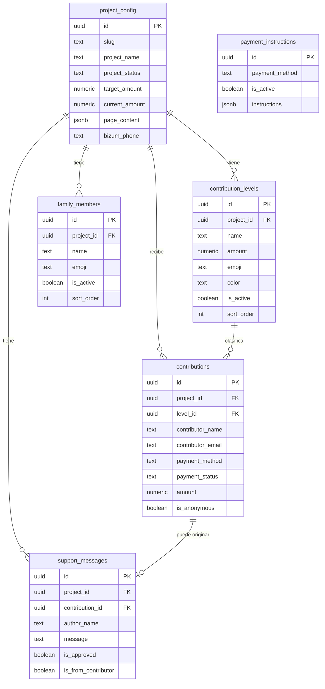

# Modelo de Datos

Base de datos: **PostgreSQL** gestionado por Supabase.

> Los tipos se infieren de las interfaces TypeScript en `src/lib/supabase.ts` y los datos de `data.json`. El esquema SQL exacto está en Supabase — no hay migraciones en el repo.

## Tablas

### `project_config`
Configuración y estado de cada campaña de crowdfunding.

| Campo | Tipo | Descripción |
|-------|------|-------------|
| `id` | uuid PK | Identificador único |
| `slug` | text | URL slug del proyecto (ej: `tablet-ana`) |
| `project_name` | text | Nombre público del proyecto |
| `project_description` | text | Descripción |
| `project_image_url` | text | URL de la imagen del producto |
| `project_status` | text | `active` \| `completed` \| `paused` \| `cancelled` |
| `target_amount` | numeric | Meta de recaudación |
| `current_amount` | numeric | Cantidad recaudada acumulada |
| `currency` | text | Moneda (ej: `EUR`) |
| `start_date` | timestamptz | Fecha de inicio |
| `end_date` | timestamptz | Fecha de cierre (opcional) |
| `redirect_url` | text | URL de redirección al finalizar |
| `page_content` | jsonb | Contenido configurable de la página (ver `ProjectPageContent`) |
| `bizum_phone` | text | Número de Bizum del proyecto |
| `bizum_concept` | text | Concepto para el Bizum |
| `emoji_options` | jsonb | Array de opciones de emoji para contribuidores |
| `created_at` | timestamptz | Fecha de creación |
| `updated_at` | timestamptz | Última actualización |

**`page_content` (JSONB):**
```json
{
  "pageTitle": "...",
  "pageSubtitle": "...",
  "productUrl": "...",
  "mainMessage": { "message": "...", "signature": "...", "familyName": "...", "date": "..." },
  "progressTitle": "...",
  "contributorsTitle": "...",
  "photoSectionTitle": "...",
  "cta": { "icon": "...", "title": "...", "text": "...", "stats": [{"number": "...", "label": "..."}] },
  "bizum_phone": "...",
  "bizum_concept": "..."
}
```

---

### `contributions`
Registro de cada aportación económica.

| Campo | Tipo | Descripción |
|-------|------|-------------|
| `id` | uuid PK | Identificador único |
| `project_id` | uuid FK → `project_config.id` | Proyecto al que pertenece |
| `contributor_name` | text | Nombre del contribuidor |
| `contributor_email` | text | Email (privado, no se muestra públicamente) |
| `contributor_emoji` | text | Emoji elegido por el contribuidor |
| `amount` | numeric | Cantidad aportada |
| `level_id` | uuid FK → `contribution_levels.id` | Nivel de contribución elegido |
| `level_name` | text | Nombre del nivel (desnormalizado) |
| `message` | text | Mensaje opcional de apoyo |
| `payment_method` | text | `bizum` \| `cash` \| `bank_transfer` |
| `payment_status` | text | `pending` \| `processing` \| `completed` \| `failed` \| `refunded` |
| `payment_reference` | text | Referencia del pago (opcional) |
| `is_anonymous` | boolean | Si el contribuidor quiere ser anónimo |
| `is_test` | boolean | Si es una contribución de prueba |
| `metadata` | jsonb | Datos adicionales |
| `created_at` | timestamptz | Fecha de creación |
| `updated_at` | timestamptz | Última actualización |
| `completed_at` | timestamptz | Fecha de completado del pago |

---

### `contribution_levels`
Niveles de participación por proyecto (ej: "Paladín", "Héroe").

| Campo | Tipo | Descripción |
|-------|------|-------------|
| `id` | uuid PK | Identificador único |
| `project_id` | uuid FK → `project_config.id` | Proyecto al que pertenece |
| `name` | text | Nombre del nivel |
| `amount` | numeric | Importe del nivel |
| `emoji` | text | Emoji del nivel |
| `description` | text | Descripción (opcional) |
| `color` | text | Color hex del nivel |
| `rewards` | jsonb | Array de recompensas |
| `is_active` | boolean | Si el nivel está disponible |
| `sort_order` | integer | Orden de visualización |
| `created_at` | timestamptz | Fecha de creación |
| `updated_at` | timestamptz | Última actualización |

---

### `family_members`
Miembros de la familia que participan en el proyecto.

| Campo | Tipo | Descripción |
|-------|------|-------------|
| `id` | uuid PK | Identificador único |
| `project_id` | uuid FK → `project_config.id` | Proyecto al que pertenece |
| `name` | text | Nombre del miembro |
| `emoji` | text | Emoji representativo |
| `age` | integer | Edad (opcional) |
| `role` | text | Rol en la familia (opcional) |
| `message` | text | Mensaje personal (opcional) |
| `avatar_url` | text | URL de avatar (opcional) |
| `is_active` | boolean | Si aparece en la página |
| `sort_order` | integer | Orden de visualización |
| `created_at` | timestamptz | Fecha de creación |
| `updated_at` | timestamptz | Última actualización |

---

### `support_messages`
Mensajes de apoyo públicos.

| Campo | Tipo | Descripción |
|-------|------|-------------|
| `id` | uuid PK | Identificador único |
| `project_id` | uuid FK → `project_config.id` | Proyecto al que pertenece |
| `author_name` | text | Nombre del autor |
| `author_emoji` | text | Emoji del autor |
| `message` | text | Contenido del mensaje |
| `is_from_contributor` | boolean | Si el autor es un contribuidor registrado |
| `contribution_id` | uuid FK → `contributions.id` | Contribución vinculada (opcional) |
| `is_approved` | boolean | Si el mensaje es visible (siempre `true` actualmente) |
| `created_at` | timestamptz | Fecha de creación |
| `updated_at` | timestamptz | Última actualización |

---

### `payment_instructions`
Configuración de métodos de pago por proyecto.

| Campo | Tipo | Descripción |
|-------|------|-------------|
| `id` | uuid PK | Identificador único |
| `payment_method` | text | `cash` \| `bizum` \| `bank_transfer` |
| `is_active` | boolean | Si el método está habilitado |
| `bizum_phone` | text | Número de Bizum (opcional) |
| `instructions` | jsonb | Template de instrucciones con `title`, `steps[]`, `tip`, `concept` |

---

## Vistas

### `project_overview`
Vista agregada con estadísticas del proyecto.

| Campo | Tipo | Descripción |
|-------|------|-------------|
| `project_name` | text | Nombre del proyecto |
| `target_amount` | numeric | Meta |
| `current_amount` | numeric | Recaudado |
| `currency` | text | Moneda |
| `progress_percentage` | numeric | % completado |
| `total_contributors` | integer | Total de contribuidores |
| `project_status` | text | Estado actual |
| `start_date` | timestamptz | Fecha de inicio |
| `end_date` | timestamptz | Fecha de cierre |

### `public_contributions`
Vista filtrada de contribuciones visibles (completadas, no de test).

| Campo | Tipo |
|-------|------|
| `id` | uuid |
| `project_id` | uuid |
| `contributor_name` | text |
| `contributor_emoji` | text |
| `amount` | numeric |
| `level_name` | text |
| `level_color` | text |
| `level_emoji` | text |
| `message` | text |
| `created_at` | timestamptz |

---

## Diagrama ER



## Función RPC en Supabase

Para incrementar `current_amount` de forma atómica, debe existir esta función en el SQL de Supabase:

```sql
create or replace function increment_project_current_amount(
  p_project_id uuid,
  p_amount numeric
) returns numeric as $$
declare
  new_amount numeric;
begin
  update project_config
  set current_amount = current_amount + p_amount,
      updated_at = now()
  where id = p_project_id
  returning current_amount into new_amount;

  if not found then
    raise exception 'Project not found';
  end if;

  return new_amount;
end;
$$ language plpgsql security definer;
```

## Migraciones

No hay sistema de migraciones en el repo. El esquema se gestiona directamente en el SQL Editor de Supabase. Para crear/modificar tablas: usar el Dashboard de Supabase > SQL Editor.
