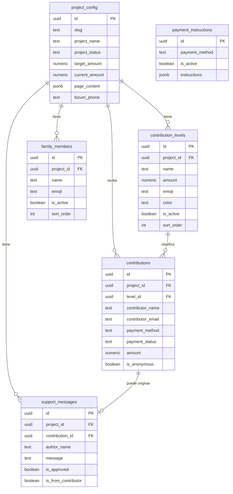

# Modelo de Datos

Base de datos: **PostgreSQL** gestionado por Supabase.

> Los tipos se infieren de las interfaces TypeScript en `src/lib/supabase.ts`. El esquema base vive en Supabase; los cambios desde 2026-09 (triggers, broadcast, defaults, índices, RLS) están versionados en `supabase/migrations/` (ver `supabase/README.md`).

## Tablas

### `project_config`
Configuración y estado de cada campaña de crowdfunding.

| Campo | Tipo | Descripción |
|-------|------|-------------|
| `id` | uuid PK | Identificador único |
| `slug` | text | URL slug del proyecto (ej: `tablet-ana`) |
| `project_name` | text | Nombre público del proyecto |
| `project_description` | text | Descripción |
| `project_image_url` | text | URL de la imagen del producto |
| `project_status` | text | `active` \| `completed` \| `paused` \| `cancelled` |
| `target_amount` | numeric | Meta de recaudación |
| `current_amount` | numeric | Cantidad recaudada acumulada |
| `currency` | text | Moneda (ej: `EUR`) |
| `start_date` | timestamptz | Fecha de inicio |
| `end_date` | timestamptz | Fecha de cierre (opcional) |
| `redirect_url` | text | URL de redirección al finalizar |
| `page_content` | jsonb | Contenido configurable de la página (ver `ProjectPageContent`) |
| `bizum_phone` | text | Número de Bizum del proyecto |
| `bizum_concept` | text | Concepto para el Bizum |
| `emoji_options` | jsonb | Array de opciones de emoji para contribuidores |
| `created_at` | timestamptz | Fecha de creación |
| `updated_at` | timestamptz | Última actualización |

**`page_content` (JSONB):**
```json
{
  "pageTitle": "...",
  "pageSubtitle": "...",
  "productUrl": "...",
  "mainMessage": { "message": "...", "signature": "...", "familyName": "...", "date": "..." },
  "progressTitle": "...",
  "contributorsTitle": "...",
  "photoSectionTitle": "...",
  "cta": { "icon": "...", "title": "...", "text": "...", "stats": [{"number": "...", "label": "..."}] },
  "bizum_phone": "...",
  "bizum_concept": "..."
}
```

---

### `contributions`
Registro de cada aportación económica.

| Campo | Tipo | Descripción |
|-------|------|-------------|
| `id` | uuid PK | Identificador único |
| `project_id` | uuid FK → `project_config.id` | Proyecto al que pertenece |
| `contributor_name` | text | Nombre del contribuidor |
| `contributor_email` | text | Email (privado, no se muestra públicamente) |
| `contributor_emoji` | text | Emoji elegido por el contribuidor |
| `amount` | numeric | Cantidad aportada. La fija el servidor a partir de `contribution_levels.amount`; el navegador no la envía |
| `level_id` | uuid FK → `contribution_levels.id` | Nivel de contribución elegido |
| `level_name` | text | Nombre del nivel (desnormalizado) |
| `message` | text | Mensaje opcional de apoyo |
| `payment_method` | text | `bizum` \| `cash` \| `bank_transfer` |
| `payment_status` | text | `pending` \| `processing` \| `completed` \| `failed` \| `refunded`. Nace `pending` (lo fija `/api/contributions`); el backoffice lo pasa a `completed` al recibir el pago. Solo `completed` cuenta para `current_amount` y la vista pública. |
| `payment_reference` | text | Referencia del pago (opcional) |
| `is_anonymous` | boolean | Si el contribuidor quiere ser anónimo |
| `is_test` | boolean | Si es una contribución de prueba |
| `metadata` | jsonb | Datos adicionales |
| `created_at` | timestamptz | Fecha de creación |
| `updated_at` | timestamptz | Última actualización |
| `completed_at` | timestamptz | Fecha de completado del pago |

---

### `contribution_levels`
Niveles de participación por proyecto (ej: "Paladín", "Héroe").

| Campo | Tipo | Descripción |
|-------|------|-------------|
| `id` | uuid PK | Identificador único |
| `project_id` | uuid FK → `project_config.id` | Proyecto al que pertenece |
| `name` | text | Nombre del nivel |
| `amount` | numeric | Importe del nivel |
| `emoji` | text | Emoji del nivel |
| `description` | text | Descripción (opcional) |
| `color` | text | Color hex del nivel |
| `rewards` | jsonb | Array de recompensas |
| `is_active` | boolean | Si el nivel está disponible |
| `sort_order` | integer | Orden de visualización |
| `created_at` | timestamptz | Fecha de creación |
| `updated_at` | timestamptz | Última actualización |

---

### `family_members`
Miembros de la familia que participan en el proyecto.

| Campo | Tipo | Descripción |
|-------|------|-------------|
| `id` | uuid PK | Identificador único |
| `project_id` | uuid FK → `project_config.id` | Proyecto al que pertenece |
| `name` | text | Nombre del miembro |
| `emoji` | text | Emoji representativo |
| `age` | integer | Edad (opcional) |
| `role` | text | Rol en la familia (opcional) |
| `message` | text | Mensaje personal (opcional) |
| `avatar_url` | text | URL de avatar (opcional) |
| `is_active` | boolean | Si aparece en la página |
| `sort_order` | integer | Orden de visualización |
| `created_at` | timestamptz | Fecha de creación |
| `updated_at` | timestamptz | Última actualización |

---

### `support_messages`
Mensajes de apoyo públicos.

| Campo | Tipo | Descripción |
|-------|------|-------------|
| `id` | uuid PK | Identificador único |
| `project_id` | uuid FK → `project_config.id` | Proyecto al que pertenece |
| `author_name` | text | Nombre del autor |
| `author_emoji` | text | Emoji del autor |
| `message` | text | Contenido del mensaje |
| `is_from_contributor` | boolean | Si el autor es un contribuidor registrado |
| `contribution_id` | uuid FK → `contributions.id` | Contribución vinculada (opcional) |
| `is_approved` | boolean | Si el mensaje es visible. Por defecto `false` (migración `20260922100200`); se aprueba desde `/admin/projects/:id/messages` |
| `created_at` | timestamptz | Fecha de creación |
| `updated_at` | timestamptz | Última actualización |

---

### `payment_instructions`
Configuración de métodos de pago por proyecto.

| Campo | Tipo | Descripción |
|-------|------|-------------|
| `id` | uuid PK | Identificador único |
| `payment_method` | text | `cash` \| `bizum` \| `bank_transfer` |
| `is_active` | boolean | Si el método está habilitado |
| `bizum_phone` | text | Número de Bizum (opcional) |
| `instructions` | jsonb | Template de instrucciones con `title`, `steps[]`, `tip`, `concept` |

---

## Vistas

### `project_overview`
Vista agregada con estadísticas del proyecto.

| Campo | Tipo | Descripción |
|-------|------|-------------|
| `project_name` | text | Nombre del proyecto |
| `target_amount` | numeric | Meta |
| `current_amount` | numeric | Recaudado |
| `currency` | text | Moneda |
| `progress_percentage` | numeric | % completado |
| `total_contributors` | integer | Total de contribuidores |
| `project_status` | text | Estado actual |
| `start_date` | timestamptz | Fecha de inicio |
| `end_date` | timestamptz | Fecha de cierre |

### `public_contributions`
Vista filtrada de contribuciones visibles (completadas, no de test).

| Campo | Tipo |
|-------|------|
| `id` | uuid |
| `project_id` | uuid |
| `contributor_name` | text |
| `contributor_emoji` | text |
| `amount` | numeric |
| `level_name` | text |
| `level_color` | text |
| `level_emoji` | text |
| `message` | text |
| `created_at` | timestamptz |

---

## Diagrama ER


```mermaid
erDiagram
    project_config {
        uuid id PK
        text slug
        text project_name
        text project_status
        numeric target_amount
        numeric current_amount
        jsonb page_content
        text bizum_phone
    }

    contribution_levels {
        uuid id PK
        uuid project_id FK
        text name
        numeric amount
        text emoji
        text color
        boolean is_active
        int sort_order
    }

    contributions {
        uuid id PK
        uuid project_id FK
        uuid level_id FK
        text contributor_name
        text contributor_email
        text payment_method
        text payment_status
        numeric amount
        boolean is_anonymous
    }

    family_members {
        uuid id PK
        uuid project_id FK
        text name
        text emoji
        boolean is_active
        int sort_order
    }

    support_messages {
        uuid id PK
        uuid project_id FK
        uuid contribution_id FK
        text author_name
        text message
        boolean is_approved
        boolean is_from_contributor
    }

    payment_instructions {
        uuid id PK
        text payment_method
        boolean is_active
        jsonb instructions
    }

    project_config ||--o{ contribution_levels : "tiene"
    project_config ||--o{ contributions : "recibe"
    project_config ||--o{ family_members : "tiene"
    project_config ||--o{ support_messages : "tiene"
    contribution_levels ||--o{ contributions : "clasifica"
    contributions ||--o| support_messages : "puede originar"
```

## Funciones, triggers y permisos

Definidos en `supabase/migrations/` (2026-09). Estado objetivo una vez aplicadas:

| Objeto | Tipo | Qué hace |
|--------|------|----------|
| `recalc_project_current_amount(uuid)` | función (security definer) | `current_amount = sum(amount)` de las contribuciones `completed` y no de prueba del proyecto |
| `contributions_recalc_amount` | trigger AFTER INSERT/UPDATE/DELETE en `contributions` | Llama a la función anterior para el proyecto afectado |
| `contributions_broadcast` | trigger AFTER INSERT/UPDATE en `contributions` | Cuando una contribución pasa a `completed`: `realtime.send(...)` al topic `project:<id>` con el evento `contribution_completed` (sin email; "Anónimo" si `is_anonymous`) |
| `support_messages_broadcast` | trigger AFTER INSERT/UPDATE en `support_messages` | Cuando `is_approved` pasa a `true`: evento `support_message_approved` |
| `increment_project_current_amount(uuid, numeric)` | RPC heredada | Se conserva pero **sin permiso de ejecución** para `anon` / `authenticated` |
| `project_config_slug_key` | índice único | `slug` único |

El servidor (`src/lib/contributions-server.ts`) recalcula también `current_amount` al confirmar un pago, así el importe se mantiene correcto aunque la migración del trigger no esté aplicada todavía.

### Políticas RLS (migración `20260922100400_rls_lockdown.sql`)

| Tabla | `anon` / `authenticated` pueden… |
|-------|----------------------------------|
| `project_config` | `SELECT` de proyectos no cancelados |
| `contribution_levels`, `family_members` | `SELECT` de filas `is_active` |
| `payment_instructions` | `SELECT` |
| `support_messages` | `SELECT` de filas `is_approved` |
| `contributions` | `SELECT` solo de `completed` y no de prueba, **sin la columna `contributor_email`** (privilegio por columna) |
| todas | Ningún `INSERT` / `UPDATE` / `DELETE` |

`service_role` (endpoints y backoffice) salta RLS. `contributions` se retira de la publicación `supabase_realtime` (`postgres_changes`).

## Migraciones

- Archivos en `supabase/migrations/*.sql`, uno por cambio, con bloque `-- down` comentado.
- Aplicación: SQL Editor del dashboard en orden, o `npx supabase db push`.
- Baseline del esquema histórico: `npx supabase db pull` (pendiente de commitear).
- Orden, dependencias con el despliegue y comprobaciones: [`supabase/README.md`](../supabase/README.md).
