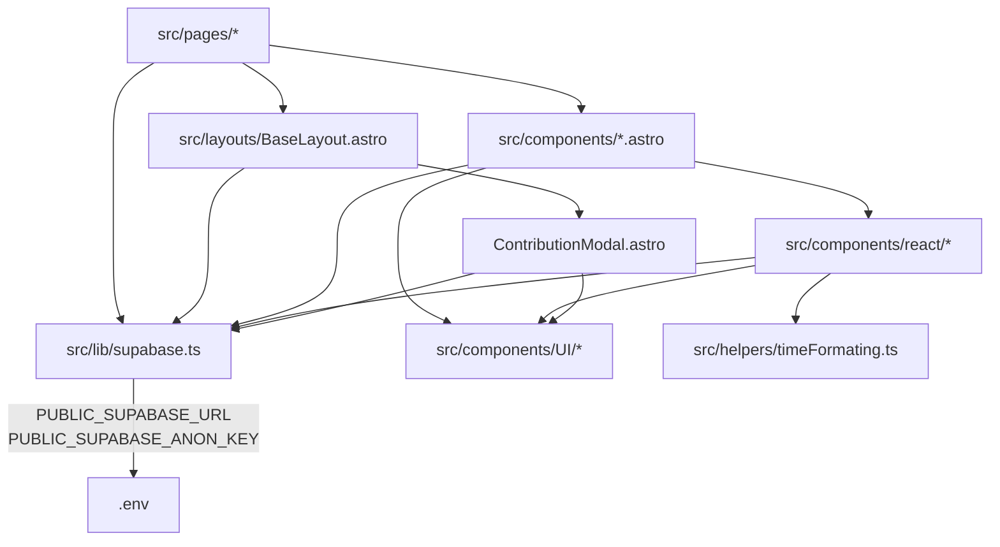

# Mapa de Archivos

## Árbol de carpetas comentado

```
gallardo-crowdfunding/
├── .github/workflows/     # CI/CD — pipeline de deploy a producción
├── docs/                  # Documentación del proyecto (este directorio)
├── public/
│   ├── img/               # Imágenes estáticas del sitio
│   └── styles/
│       └── global.css     # CSS global (tipografía, reset, layout base)
├── src/
│   ├── components/        # Componentes Astro reutilizables
│   │   ├── react/         # Islands de React (interactivos, hidratados en cliente)
│   │   │   ├── ContributorsList/    # Lista de contribuidores en tiempo real
│   │   │   └── SupportMessageSection/  # Muro de mensajes de apoyo
│   │   └── UI/            # Componentes UI atómicos (Modal, Spinner, Botones)
│   ├── helpers/           # Utilidades puras sin efectos secundarios
│   ├── layouts/           # HTML shell + header + footer
│   │   └── lego/          # Layout alternativo para páginas Lego (experimento)
│   ├── lib/
│   │   └── supabase.ts    # TODO el acceso a datos: tipos, queries, mutations, realtime
│   ├── pages/
│   │   ├── api/           # Endpoints de API (JSON)
│   │   ├── info/          # Páginas informativas estáticas (tablet_ana)
│   │   ├── lego/          # Páginas experimentales de tema Lego
│   │   └── projects/      # Páginas de proyecto dinámicas ([slug].astro)
│   └── styles/
│       └── globals.css    # CSS global alternativo (sin uso activo)
├── astro.config.mjs       # Configuración de Astro (SSR, adaptador, integraciones)
├── data.json              # Datos de muestra / fallback local
├── package.json           # Dependencias y scripts
└── tsconfig.json          # Configuración TypeScript
```

## ¿Dónde está qué?

| Si quiero tocar… | Ir a… | Archivos clave |
|-----------------|-------|----------------|
| Añadir una nueva página de proyecto | `src/pages/projects/` | `[slug].astro` |
| Añadir una nueva ruta/endpoint | `src/pages/api/` | `data.json.ts` (ejemplo) |
| Cambiar el HTML de una sección de la página de proyecto | `src/components/` | `ProductCard.astro`, `ProgressSection.astro`, `ContributionLevels.astro`, `MessageSection.astro`, `FamilyPhotos.astro` |
| Modificar la lista de contribuidores (interactiva) | `src/components/react/ContributorsList/` | `ContributorsList.tsx`, `style.css` |
| Modificar el muro de mensajes de apoyo | `src/components/react/SupportMessageSection/` | `SupportMessageSection.tsx`, `SupportMessage/SupportMessage.tsx` |
| Cambiar el modal de contribución | `src/components/` | `ContributionModal.astro` |
| Modificar el header | `src/layouts/` | `Header.astro` |
| Modificar el footer | `src/layouts/` | `Footer.astro` |
| Cambiar el layout base (HTML shell, `<head>`) | `src/layouts/` | `BaseLayout.astro` |
| Añadir/modificar una query a Supabase | `src/lib/` | `supabase.ts` |
| Añadir un nuevo tipo TypeScript del dominio | `src/lib/` | `supabase.ts` (sección TIPOS) |
| Añadir/modificar suscripción en tiempo real | `src/lib/` | `supabase.ts` (sección SUSCRIPCIONES) |
| Cambiar estilos globales | `public/styles/` | `global.css` |
| Cambiar una variable de entorno | raíz + CI | `.env`, `.github/workflows/deploy.yml` (secret `ENV_LOCAL`) |
| Modificar el pipeline de CI/CD | `.github/workflows/` | `deploy.yml` |
| Añadir una dependencia npm | raíz | `package.json` |
| Cambiar la configuración de Astro | raíz | `astro.config.mjs` |
| Formatear fechas / tiempo relativo | `src/helpers/` | `timeFormating.ts` |
| Añadir componente UI reutilizable (modal, botón, spinner) | `src/components/UI/` | `Modal.astro`, `CloseButton.astro`, `Spinner/Spinner.tsx` |
| Añadir/modificar el formulario de mensaje de apoyo | `src/components/` | `SupportMessageFrom.astro` |
| Añadir fotos de familia | Supabase Storage | Bucket `project-assets/projects/{projectId}/fotoFami/` |
| Página informativa de un producto específico | `src/pages/info/` | `tablet_ana/index.astro` |

## Grafo de dependencias entre módulos principales



## Archivos frágiles

Estos archivos afectan a muchos otros — modificarlos puede romper cosas inesperadamente:

| Archivo | Por qué es frágil |
|---------|------------------|
| `src/lib/supabase.ts` | Contiene TODOS los tipos TypeScript y TODA la lógica de acceso a datos. Un cambio de interfaz aquí rompe todos los componentes que consumen esos tipos. |
| `src/layouts/BaseLayout.astro` | Envuelve TODAS las páginas. Controla el `<head>`, carga de CSS, y monta `ContributionModal` global. Un error aquí rompe todas las páginas. |
| `astro.config.mjs` | Configuración del adaptador SSR. Cambiar el modo de salida o el adaptador requiere rebuild completo y posibles cambios en la infraestructura. |
| `.github/workflows/deploy.yml` | Un error en el workflow puede dejar producción sin deployar o en estado inconsistente. |
| `public/styles/global.css` | Estilos globales que afectan a toda la UI. |

## Archivos aislados

Seguros de tocar sin efectos colaterales importantes:

| Archivo | Por qué es seguro |
|---------|------------------|
| `src/helpers/timeFormating.ts` | Utilidad pura sin imports de Supabase ni estado global. |
| `src/components/UI/Spinner/Spinner.tsx` | Componente visual sin lógica de negocio. |
| `src/components/UI/CompletedBage.astro` | Badge visual puro, sin estado. |
| `data.json` | Datos de muestra locales, no usados en producción. |
| `src/pages/info/tablet_ana/index.astro` | Página informativa aislada, sin afectar otras rutas. |
| `src/pages/lego/DD/index.astro` | Página experimental, sin integración con el flujo principal. |
| `public/img/*` | Imágenes estáticas. |
