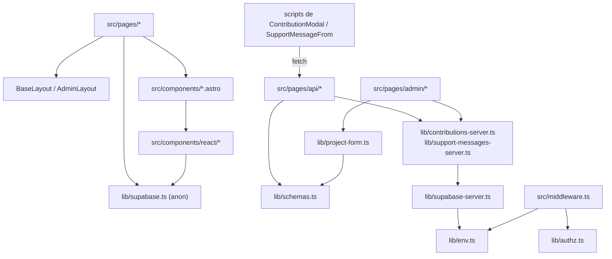

# Mapa de Archivos

## Árbol de carpetas comentado

```
gallardo-crowdfunding/
├── .claude/settings.json      # Permisos + hooks PreToolUse de graphify para Claude Code (no versionado)
├── .github/
│   ├── dependabot.yml         # Actualizaciones semanales de npm y GitHub Actions
│   └── workflows/
│       ├── ci.yml             # PR: check + lint + test + build + audit
│       └── deploy.yml         # push master: verify → build → release en el VPS + pm2 reload
├── .rtk/filters.toml          # Filtros locales de RTK (compresión de salida de comandos)
├── docs/                      # Documentación del proyecto (este directorio)
├── graphify-out/              # Grafo de conocimiento (regenerable con /graphify; ignorado en git)
├── public/
│   ├── favicon.svg, logo-preview.svg
│   ├── img/                   # Imágenes estáticas
│   └── styles/global.css      # CSS global público
├── src/
│   ├── components/            # Secciones de la página de proyecto (Astro)
│   │   ├── ProjectsList.astro         # Tarjetas de proyecto (home y portada del espacio)
│   │   ├── Breadcrumbs.astro          # Migas "Inicio › Espacio › Proyecto"
│   │   ├── ContributionLevels.astro   # Niveles (botones) + tarjeta "Otra cantidad" → evento levelSelected
│   │   ├── OpenCampaignSection.astro  # Progreso de campañas por tiempo (totales + cuenta atrás)
│   │   ├── ContributionModal.astro    # Modal: formulario → POST /api/contributions
│   │   ├── SupportMessageFrom.astro   # Formulario → POST /api/support-messages
│   │   ├── react/
│   │   │   ├── ContributorsList/          # Island: lista de contribuidores + broadcast
│   │   │   └── SupportMessageSection/     # Island: muro de mensajes + broadcast
│   │   └── UI/                # Modal, CloseButton, Spinner, CompletedBage
│   ├── helpers/timeFormating.ts   # Tiempo relativo ("hace 2 días")
│   ├── layouts/
│   │   ├── BaseLayout.astro   # Shell público; recibe project + paymentMethods por props
│   │   ├── AdminLayout.astro  # Shell del backoffice (noindex)
│   │   ├── Header.astro, Footer.astro
│   ├── lib/
│   │   ├── supabase.ts               # Cliente anon: tipos, LECTURAS y subscribeToProjectEvents
│   │   ├── supabase-server.ts        # Cliente service_role (solo servidor)
│   │   ├── contributions-server.ts   # Crear pendiente, cambiar estado, recalcular importe, listar
│   │   ├── support-messages-server.ts# Crear pendiente, aprobar, borrar, listar
│   │   ├── themes.ts                 # Temas: colores (tokens) + emojis + textos de sección; getTheme, themeCss
│   │   ├── tenants.ts                # Espacios: número de 6 dígitos, URLs (/<n>/projects/<slug>), iniciales, siteOrigin
│   │   ├── tenants-server.ts         # getTenantForUser (service role)
│   │   ├── campaign.ts               # isCampaignOpen, daysLeft, campaignTotals, formatEndDate
│   │   ├── project-image-server.ts   # Subida de la imagen de portada a Storage (validación + ruta)
│   │   ├── client/campaign-form.ts   # Backoffice: muestra los campos según el modo de campaña
│   │   ├── client/level-rows.ts      # Backoffice (alta): filas de niveles clonando un <template>
│   │   ├── client/ai-draft.ts        # Backoffice (alta): panel "Rellenar con IA" → vuelca el borrador
│   │   ├── client/form-restore.ts    # Backoffice (alta): recupera lo escrito tras un error del servidor
│   │   ├── project-draft.ts          # Borrador IA: esquemas Zod, normalizeDraft, prompt de sistema (puro)
│   │   ├── project-draft-form.ts     # Borrador IA → valores de los campos del formulario (sin Zod)
│   │   ├── project-draft-route.ts    # Lógica de POST /admin/api/draft-project (inyectable, testeable)
│   │   ├── project-draft-server.ts   # Llamada a Claude con salida estructurada (solo servidor)
│   │   ├── schemas.ts                # Zod: ContributionInput, SupportMessageInput, ProjectFormInput
│   │   ├── project-form.ts           # FormData del backoffice → fila de project_config; parseLevelRows
│   │   ├── env-schema.ts, env.ts     # Validación de variables de entorno al arrancar
│   │   ├── authz.ts                  # isAdminUser
│   │   ├── session-cookies.ts        # Cookies HttpOnly de la sesión admin
│   │   ├── api.ts                    # json(), clientIp(), readJson()
│   │   ├── rate-limit.ts             # Limitador en memoria por IP
│   │   ├── format.ts                 # currencySymbol, formatAmount
│   │   └── html.ts                   # escapeHtml
│   ├── middleware.ts          # Cabeceras de seguridad; auth + rol + refresco en /admin/*
│   ├── pages/
│   │   ├── index.astro        # Escaparate de proyectos públicos de todos los espacios
│   │   ├── 404.astro
│   │   ├── design-system.astro# Showcase de tokens (solo dev)
│   │   ├── [tenant]/index.astro           # Portada del espacio (/<número>)
│   │   ├── [tenant]/projects/[slug].astro # Página del proyecto (/<número>/projects/<slug>)
│   │   ├── projects/[slug].astro          # URL antigua → 301 a la nueva
│   │   ├── api/
│   │   │   ├── contributions.ts      # POST
│   │   │   └── support-messages.ts   # POST
│   │   └── admin/
│   │       ├── login.astro, logout.astro, index.astro
│   │       ├── api/draft-project.ts  # POST: borrador de proyecto con IA (requiere sesión admin)
│   │       └── projects/
│   │           ├── new.astro
│   │           └── [id]/edit.astro, contributions.astro, messages.astro
│   └── styles/tokens.css      # Variables CSS del design system
├── supabase/
│   ├── README.md              # Cómo aplicar migraciones, baseline, rol admin
│   ├── migrations/*.sql       # Trigger de importe, broadcast, moderación, slug único, RLS, campañas abiertas
│   └── seeds/*.sql            # Datos de proyectos concretos (bici de Máximo)
├── tests/*.test.ts            # Vitest: env, schemas, project-form, project-draft(+route), client-forms (happy-dom), tenants, breadcrumbs, rate-limit, api, authz, format, html, themes
├── .env.example
├── astro.config.mjs
├── ecosystem.config.cjs       # PM2 en producción (cwd = current/, modo cluster)
├── eslint.config.js, .prettierrc, vitest.config.ts
├── package.json
└── tsconfig.json
```

## ¿Dónde está qué?

| Si quiero tocar… | Ir a… | Archivos clave |
|-----------------|-------|----------------|
| La página de un proyecto | `src/pages/projects/` | `[slug].astro` |
| Cómo se crea una contribución (validación, importe, estado) | `src/lib/`, `src/pages/api/` | `schemas.ts`, `contributions-server.ts`, `api/contributions.ts` |
| Cómo se crea/aprueba un mensaje de apoyo | `src/lib/`, `src/pages/api/`, `src/pages/admin/` | `support-messages-server.ts`, `api/support-messages.ts`, `projects/[id]/messages.astro` |
| Confirmar pagos desde el backoffice | `src/pages/admin/projects/[id]/` | `contributions.astro` |
| Campañas por tiempo (cierre, cuenta atrás, base, cantidad libre) | `src/lib/`, `src/components/` | `campaign.ts`, `OpenCampaignSection.astro`, `ContributionLevels.astro` |
| Temas (colores y emojis de la página de un proyecto) | `src/lib/`, `src/styles/` | `themes.ts` (añadir/editar temas), `tokens.css` (tokens que sobrescriben) |
| Crear/editar proyectos, niveles, emojis | `src/pages/admin/projects/` | `new.astro`, `[id]/edit.astro`, `src/lib/project-form.ts` |
| Quién puede entrar al backoffice | `src/` | `middleware.ts`, `lib/authz.ts`, `.env` (`ADMIN_EMAILS`) |
| Cabeceras de seguridad / CSP | `src/` | `middleware.ts` |
| El modal de contribución | `src/components/` | `ContributionModal.astro` (script cliente) |
| Lista de contribuidores en tiempo real | `src/components/react/ContributorsList/` | `ContributorsList.tsx`, `src/lib/supabase.ts` (`subscribeToProjectEvents`) |
| Una consulta pública a Supabase | `src/lib/` | `supabase.ts` |
| Esquema, triggers, RLS | `supabase/migrations/` | ver `supabase/README.md` |
| Variables de entorno | raíz + `src/lib/` | `.env.example`, `env-schema.ts`, secret `ENV_LOCAL` |
| Pipeline de CI/CD y despliegue | `.github/workflows/`, raíz | `ci.yml`, `deploy.yml`, `ecosystem.config.cjs` |
| Tests | `tests/` | un archivo por módulo de `src/lib` |
| Tokens del design system | `src/styles/` | `tokens.css` (showcase en `pages/design-system.astro`) |
| Fotos de familia | Supabase Storage | bucket `project-assets/projects/{projectId}/fotoFami/` |
| Consultar el grafo del repo / ahorrar tokens | raíz | `graphify-out/`, `.rtk/filters.toml` (ver COMMANDS.md) |

## Grafo de dependencias entre módulos principales


```mermaid
graph TD
    Pages["src/pages/*"] --> Layouts["BaseLayout / AdminLayout"]
    Pages --> Components["src/components/*.astro"]
    Pages --> SupabaseRead["lib/supabase.ts (anon)"]
    Api["src/pages/api/*"] --> Schemas["lib/schemas.ts"]
    Api --> Servers["lib/contributions-server.ts<br/>lib/support-messages-server.ts"]
    Admin["src/pages/admin/*"] --> Servers
    Admin --> ProjectForm["lib/project-form.ts"] --> Schemas
    Servers --> AdminClient["lib/supabase-server.ts"] --> Env["lib/env.ts"]
    Middleware["src/middleware.ts"] --> Env
    Middleware --> Authz["lib/authz.ts"]
    Components --> ReactIslands["src/components/react/*"] --> SupabaseRead
    ClientScripts["scripts de ContributionModal / SupportMessageFrom"] -->|fetch| Api
```

## Archivos frágiles

| Archivo | Por qué es frágil |
|---------|------------------|
| `src/lib/supabase.ts` | Tipos de dominio compartidos por todo el frontend. |
| `src/lib/schemas.ts` | Un cambio aquí cambia lo que aceptan los endpoints y el backoffice. |
| `src/middleware.ts` | Corre en todas las peticiones; un error deja la web sin servicio. La CSP puede bloquear recursos nuevos. |
| `src/layouts/BaseLayout.astro` | Envuelve todas las páginas públicas y monta el modal. |
| `supabase/migrations/20260922100400_rls_lockdown.sql` | Cambia permisos en producción; aplicar solo con el código nuevo desplegado. |
| `.github/workflows/deploy.yml` | Un error deja producción sin desplegar. |

## Archivos aislados

| Archivo | Por qué es seguro |
|---------|------------------|
| `src/lib/format.ts`, `src/lib/html.ts`, `src/helpers/timeFormating.ts` | Funciones puras con tests. |
| `src/components/UI/Spinner/Spinner.tsx`, `src/components/UI/CompletedBage.astro` | Visuales sin lógica. |
| `src/pages/design-system.astro` | Solo en desarrollo. |
| `public/img/*` | Estáticos. |
