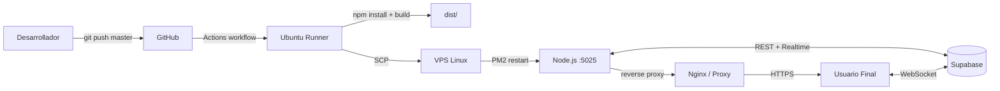

# Infraestructura

## Entorno local

```bash
npm install
# Crear archivo .env con las variables listadas abajo
npm run dev      # Puerto 4321 por defecto
```

No hay Docker ni docker-compose local. El entorno es Node.js puro.

## Variables de entorno requeridas

| Variable | Descripción | Obligatoria |
|----------|-------------|-------------|
| `PUBLIC_SUPABASE_URL` | URL del proyecto Supabase (ej: `https://xxx.supabase.co`) | Sí |
| `PUBLIC_SUPABASE_ANON_KEY` | Clave anon/pública de Supabase | Sí |
| `SUPABASE_SERVICE_ROLE_KEY` | Clave de servicio (sin prefijo PUBLIC_) — solo para el backoffice servidor | Sí (admin) |

> Crear `.env` en la raíz del proyecto con estas dos variables. No hay `.env.example` en el repo — ver COMMANDS.md para el comando de creación rápida.

## Producción

| Elemento | Valor |
|----------|-------|
| Servidor | VPS propio (Linux) |
| Directorio | `/var/www/gallardo-crowdfunding` |
| Proceso | PM2 — nombre: `gallardo-crowdfunding` |
| Puerto | `5025` (bind: `127.0.0.1`) |
| URL pública | `https://gc.gallardcode.com` |
| Node.js | v22 (gestionado con nvm) |
| Entrypoint | `./server/entry.mjs` |

El servidor HTTP externo (nginx/caddy) actúa de reverse proxy hacia `127.0.0.1:5025`. No está en el repo — se asume configurado manualmente en el VPS.

## Servicios externos

| Servicio | Propósito |
|----------|-----------|
| **Supabase** | PostgreSQL (BD), Realtime (WebSockets), Storage (imágenes) |
| **Google Fonts** | Fuente Poppins cargada en el HTML |
| **GitHub Actions** | CI/CD — build + deploy vía SSH/SCP |
| **Stripe** | Instalado, no activo aún |

## Diagrama de despliegue



## Pipeline de CI/CD — paso a paso

El workflow está en `.github/workflows/deploy.yml` y se dispara con push a `main` o `master`.

| Paso | Acción |
|------|--------|
| 1 | `actions/checkout@v4` — clonar el repo |
| 2 | `actions/setup-node@v4` — Node.js 22 con caché npm |
| 3 | `npm install --legacy-peer-deps` |
| 4 | Crear `.env` desde el secret `ENV_LOCAL` |
| 5 | `npm run build` — genera `dist/` |
| 6 | Verificar que `dist/` existe |
| 7 | SSH → limpiar `/var/www/gallardo-crowdfunding` (excepto `node_modules` y `.env`) |
| 8 | SCP → copiar `dist/*` al servidor |
| 9 | SCP → copiar `package.json` y `package-lock.json` |
| 10 | SSH → escribir `.env` en el servidor desde secret `ENV_LOCAL` |
| 11 | SSH → `npm ci --omit=dev`, luego `pm2 restart` o `pm2 start` |

### Secrets de GitHub requeridos

| Secret | Descripción |
|--------|-------------|
| `ENV_LOCAL` | Contenido completo del archivo `.env` de producción |
| `SERVER_HOST` | IP o hostname del VPS |
| `SERVER_USER` | Usuario SSH del VPS |
| `SERVER_SSH_KEY` | Clave privada SSH |
