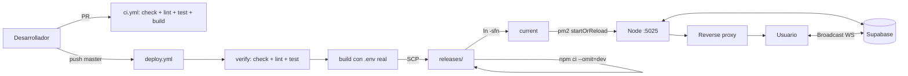

# Infraestructura

## Entorno local

```bash
npm install
cp .env.example .env    # rellenar con las credenciales de Supabase
npm run dev             # http://localhost:4321
```

No hay Docker. El entorno es Node.js 22 puro. Comprobaciones: `npm run check`, `npm run lint`, `npm test`.

## Variables de entorno

Validadas al arrancar por `src/lib/env-schema.ts` (Zod): si falta alguna obligatoria el servidor no arranca.
Astro **incrusta** `import.meta.env.*` en tiempo de build, por eso el `.env` real debe existir en el runner
de GitHub Actions al hacer `npm run build`.

| Variable | Descripción | Obligatoria |
|----------|-------------|-------------|
| `PUBLIC_SUPABASE_URL` | URL del proyecto Supabase | Sí |
| `PUBLIC_SUPABASE_ANON_KEY` | Clave anon (se expone al navegador; solo lecturas gracias a RLS) | Sí |
| `SUPABASE_SERVICE_ROLE_KEY` | Clave de servicio: endpoints `/api/*` y backoffice. Nunca con prefijo `PUBLIC_` | Sí |
| `ADMIN_EMAILS` | Emails (coma) con acceso al backoffice además de los usuarios con `app_metadata.role = 'admin'` | No |

## Producción

| Elemento | Valor |
|----------|-------|
| Servidor | VPS propio (Linux), Node 22 vía nvm |
| Base | `/var/www/gallardo-crowdfunding` |
| Releases | `releases/<sha>/` (se conservan las 3 últimas) |
| Activa | symlink `current` → `releases/<sha>` |
| Proceso | PM2 `gallardo-crowdfunding`, modo cluster (1 instancia), definido en `ecosystem.config.cjs` |
| Puerto | `5025` en `127.0.0.1` (nginx/caddy hace de reverse proxy, fuera del repo) |
| URL pública | `https://gc.gallardcode.com` |
| Entrypoint | `current/server/entry.mjs` |

Cada release contiene `server/`, `client/`, `package.json`, `package-lock.json`, `ecosystem.config.cjs`, `.env` y sus `node_modules` de producción.

## Servicios externos

| Servicio | Propósito |
|----------|-----------|
| **Supabase** | Postgres (con RLS), Auth (admin), Realtime Broadcast, Storage (`project-assets`) |
| **Google Fonts** | Poppins (público) e Inter (backoffice) |
| **GitHub Actions** | CI en PR y deploy en push a `master` (rama por defecto del repo) |

## Base de datos: migraciones y permisos

Las migraciones están en `supabase/migrations/` y se aplican con el SQL Editor o `npx supabase db push`
(orden y detalles en [`supabase/README.md`](../supabase/README.md)). Resumen del estado objetivo:

- `current_amount` lo recalcula un trigger; la RPC `increment_project_current_amount` no es invocable por `anon`.
- Realtime: Broadcast por proyecto desde triggers; `contributions` fuera de `postgres_changes`.
- RLS activo: `anon` solo lee lo público y nunca `contributor_email`.
- `support_messages.is_approved` por defecto `false`; índice único en `project_config.slug`.

## Acceso al backoffice

1. Crear el usuario en Supabase → Authentication → Users.
2. Darle rol admin (`update auth.users set raw_app_meta_data = raw_app_meta_data || '{"role":"admin"}' where email = '…'`)
   **o** añadir su email a `ADMIN_EMAILS` (local y en el secret `ENV_LOCAL`).
3. Desactivar el alta libre: Authentication → Providers → Email → *Allow new users to sign up* = off.

## Diagrama de despliegue


```mermaid
graph LR
    Dev[Desarrollador] -->|PR| CI[ci.yml: check + lint + test + build]
    Dev -->|push master| GH[deploy.yml]
    GH --> Verify[verify: check + lint + test]
    Verify --> Build[build con .env real]
    Build -->|SCP| Rel["releases/<sha>"]
    Rel -->|npm ci --omit=dev| Rel
    Rel -->|ln -sfn| Cur[current]
    Cur -->|pm2 startOrReload| Node[Node :5025]
    Node --> Nginx[Reverse proxy] --> User[Usuario]
    Node <--> Supabase[(Supabase)]
    User <-->|Broadcast WS| Supabase
```

## Pipeline de despliegue — paso a paso (`.github/workflows/deploy.yml`)

| Paso | Job | Acción |
|------|-----|--------|
| 1 | verify | `npm ci`, `.env` de prueba, `astro check`, `eslint`, `vitest` |
| 2 | deploy | `npm ci`, crear `.env` desde `ENV_LOCAL`, `npm run build`, verificar `dist/server/entry.mjs` |
| 3 | deploy | SSH: `mkdir -p releases/<sha>` |
| 4 | deploy | SCP: `dist/*` + `package.json`, `package-lock.json`, `ecosystem.config.cjs` |
| 5 | deploy | SSH: escribir `.env`, `npm ci --omit=dev`, symlink `current` (atómico), borrar proceso PM2 antiguo si apunta al layout viejo, `pm2 startOrReload ecosystem.config.cjs`, `pm2 save`, podar releases |

Las acciones de GitHub están fijadas por SHA (`actions/checkout`, `actions/setup-node`, `appleboy/ssh-action`, `appleboy/scp-action`) y Dependabot propone actualizaciones semanales (npm + actions).

### Secrets de GitHub requeridos

| Secret | Descripción |
|--------|-------------|
| `ENV_LOCAL` | Contenido completo del `.env` de producción (incluye `ADMIN_EMAILS` si se usa) |
| `SERVER_HOST` | IP o hostname del VPS |
| `SERVER_USER` | Usuario SSH |
| `SERVER_SSH_KEY` | Clave privada SSH |

El job `deploy` usa el environment `production` de GitHub; se le puede exigir aprobación manual desde Settings → Environments.

## Cabeceras de seguridad

`src/middleware.ts` añade en todas las respuestas `X-Content-Type-Options`, `X-Frame-Options: DENY`, `Referrer-Policy`,
`Permissions-Policy` y, solo en producción, una `Content-Security-Policy` (`default-src 'self'`, Supabase en `connect-src`,
Google Fonts en `style-src`/`font-src`, `frame-ancestors 'none'`). En `/admin/*` añade `X-Robots-Tag: noindex` y `Cache-Control: no-store`.
